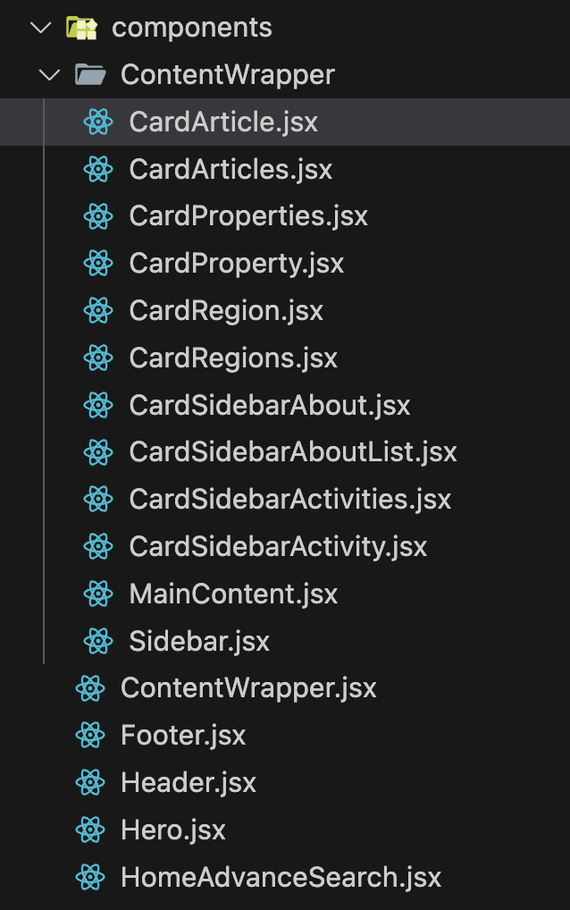
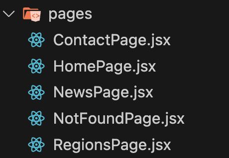
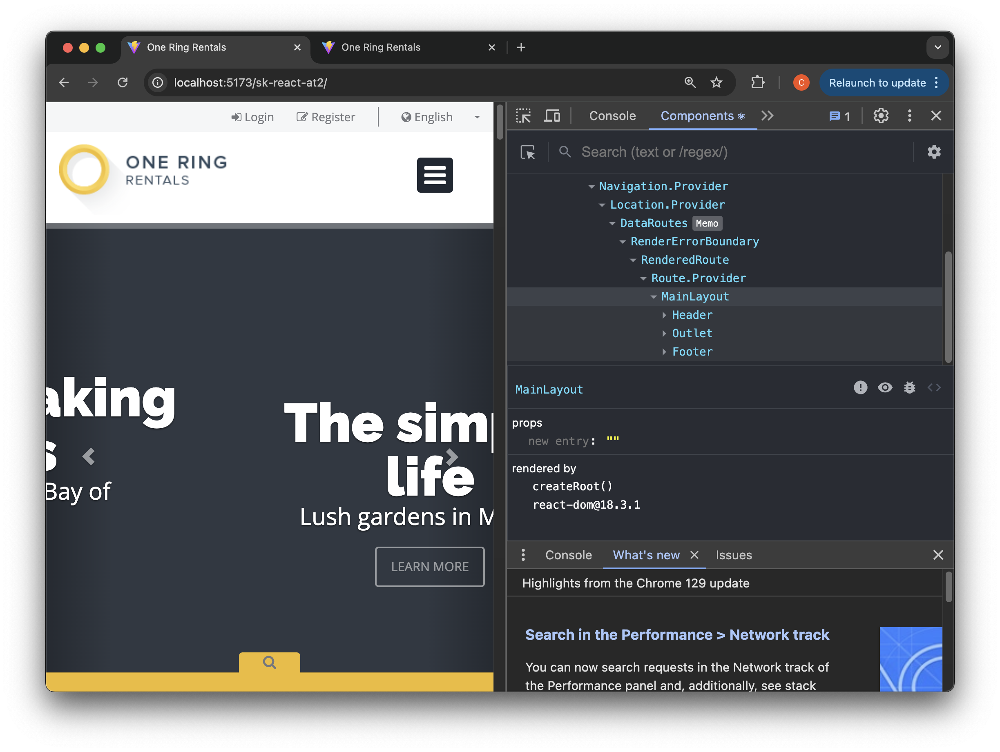
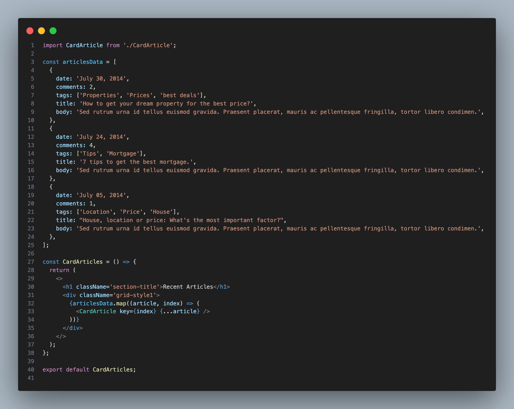
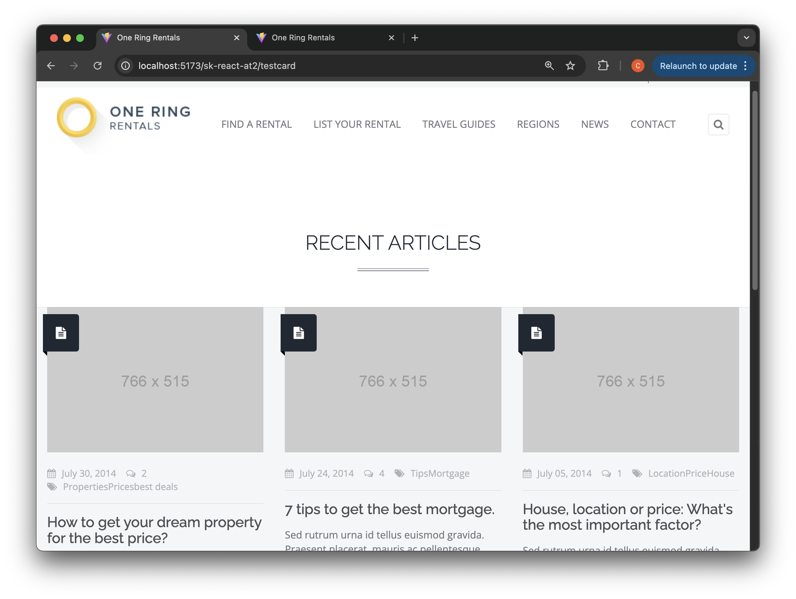
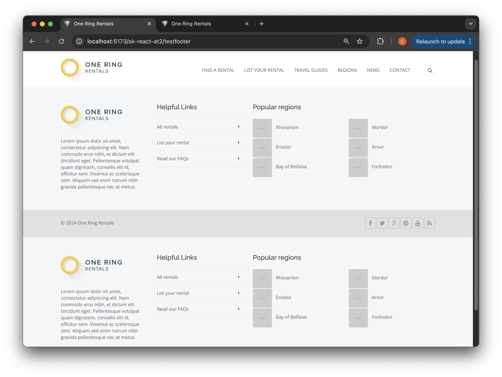
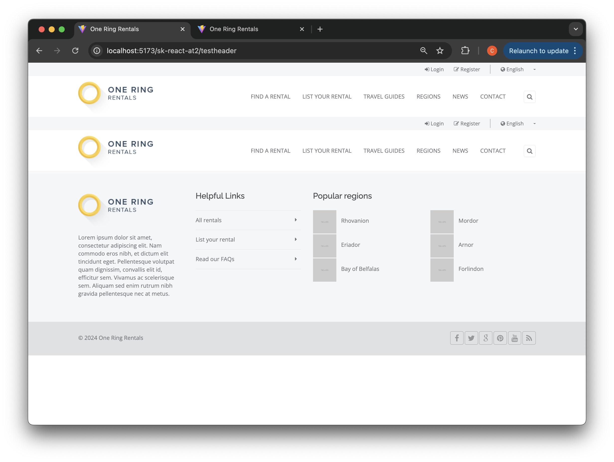
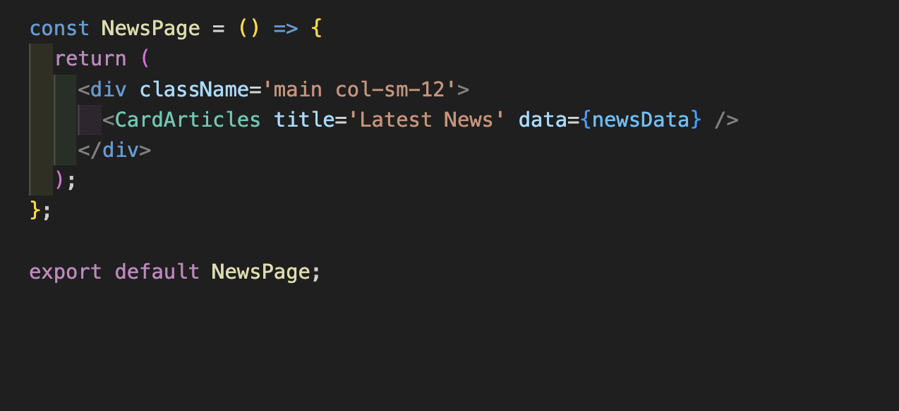
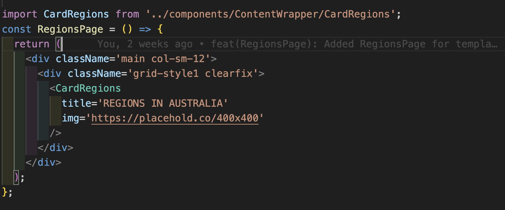

# Assessment

## Index

- [Develop the "One RIng Rentals"](#develop-the-one-ring-rentals-site-use-react)
- [Working evidences](#working-evidences)
- [Bug $ Issues](#bug--issues)

## Develop the "One Ring Rentals" site use React

[back](#index)

In this assessment, I used React with Vite.

## Working evidences

[back](#index)

- Custom Components  
  

- Each HTML page in the site becomes a reusable React component.

  

- Components thoroughly covered in Chrome React Extension
  

- Reuse example  
  

- Each component
  

- Reuse footer components
  

- Reuse header components
  

- Reuse components for News Page
  

- Reuse components for Regions Page
  

## Bug & Issues

[back](#index)

1. Media Query Issue
   When switching from full screen to mobile screen, navigation links are not displayed when clicking the hamburger button. This functionality worked on static pages but stopped working after breaking down into smaller components.

2. Advanced Search Page CSS Error
   There are two missing styles. This feature was working on single static pages but is not functioning properly after splitting into small components.
